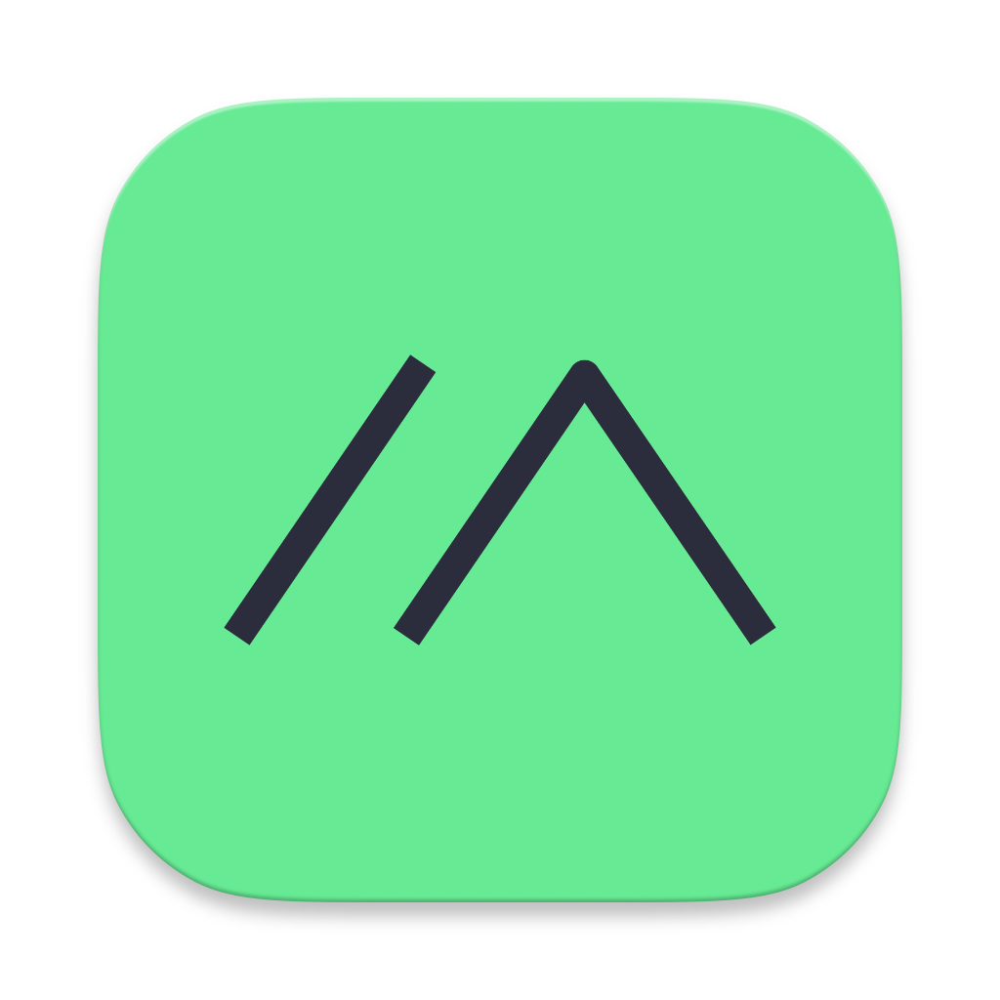

  <h1 align="center"> Meshtastic Documentation
</h1>
  
Website and documentation source for the Meshtastic project.

## Development & Building

For complete instructions on setting up your development environment and for building and running the docs project locally, please refer to our [Local Development Guide](https://meshtastic.org/docs/development/documentation/local-dev/).

## Stats

