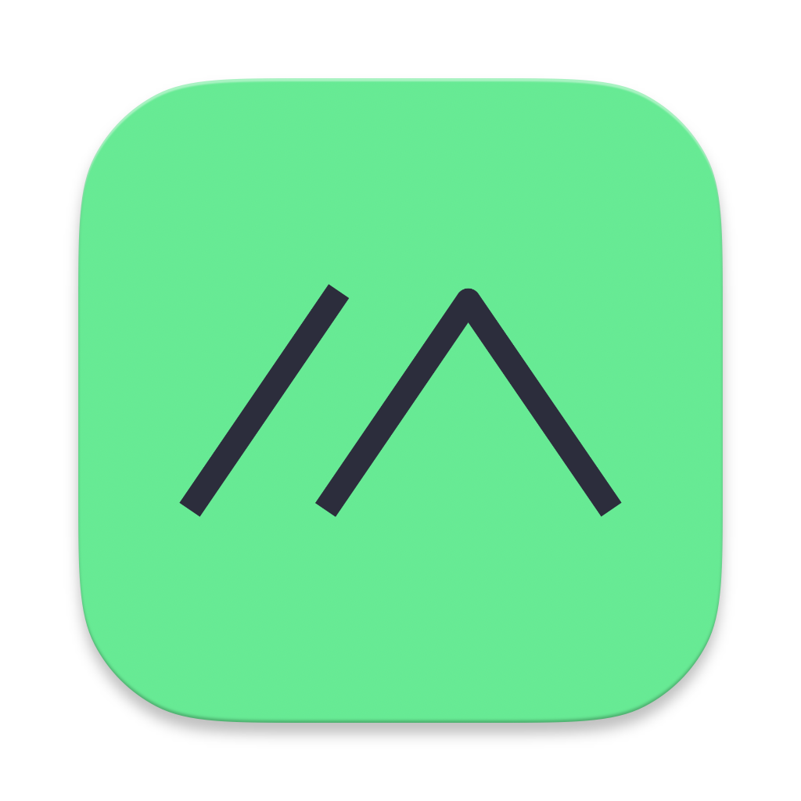

  <h1 align="center"> Meshtastic Documentation
</h1>
  
Website and documentation source for the Meshtastic project.

## About this repository

This repository publishes [meshtastic.org](https://meshtastic.org). It holds the written documentation for the firmware, the clients, and the hardware.

The code those pages describe lives elsewhere. Firmware, clients, and tooling each have their own repository under the [Meshtastic organization](https://github.com/meshtastic).

Pages are MDX, and the site is built with [Docusaurus](https://docusaurus.io). Most content changes are ordinary Markdown edits.

## Contributing

Read [CONTRIBUTING.md](CONTRIBUTING.md) first. Every pull request links to an issue, a one-line typo fix included, and that guide covers how to open one.

Two parts of the tree don't take pull requests here:

- Android and Apple client pages under `docs/software/android` and `docs/software/apple` are written in the client repositories and synced in. Open those against [Meshtastic-Android](https://github.com/meshtastic/Meshtastic-Android) or [Meshtastic-Apple](https://github.com/meshtastic/Meshtastic-Apple).
- Documentation for released firmware is frozen under `versioned_docs/`. Edit the current release under `docs/`, which becomes the next snapshot.

Section 11 of the [Meshtastic Client Design Standards](https://github.com/meshtastic/design/tree/master/standards) governs writing across the project. [Writing style](https://meshtastic.org/docs/development/documentation/style-guides/writing-style) is the working guide reviewers check against.

## Development and building

For setting up a development environment and building the site locally, read the [local development guide](https://meshtastic.org/docs/development/documentation/local-dev/).

Run `pnpm run build` before opening a pull request. It is the status check branch protection requires, and a link to a page that doesn't exist fails it rather than reaching the site.

## Stats

