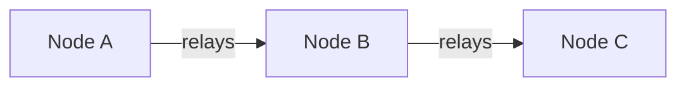

import { Dark, Light } from "@site/src/components/ColorMode";

Pages are MDX, which is Markdown that can import and use React components. This page covers what is available here. [Writing style](./writing-style.mdx) covers when to reach for each one.

## Code blocks

Tag the language directly after the opening fence. Use `shell` for command-line examples rather than `bash`, `sh`, or `console`, so command blocks render the same everywhere.

Add `title="..."` where the block needs a label, such as a file name.

````
```ts title="Demo"
export const typedArrayToBuffer = (array: Uint8Array): ArrayBuffer => {
  return array.buffer.slice(array.byteOffset, array.byteLength + array.byteOffset);
};
```
````

```ts title="Demo"
export const typedArrayToBuffer = (array: Uint8Array): ArrayBuffer => {
  return array.buffer.slice(
    array.byteOffset,
    array.byteLength + array.byteOffset,
  );
};
```

## Client tabs

Per-client instructions go in tabs. Keep the platform order the same on every page, with the CLI first where it exists. Give each tab a heading one level deeper than the section containing the tab block.

```mdx
import Tabs from "@theme/Tabs";
import TabItem from "@theme/TabItem";

<Tabs
groupId="settings"
defaultValue="cli"
values={[
{label: 'CLI', value: 'cli'},
{label: 'Android', value: 'android'},
{label: 'iOS', value: 'iOS'},
{label: 'Web', value: 'web'},
]}>
<TabItem value="cli">

#### CLI

CLI instructions here

</TabItem>
</Tabs>
```

Markdown inside a `TabItem` needs a blank line above and below it, or it renders as literal text rather than as a heading.

A shared `groupId` keeps a reader's choice selected as they move between pages.

## Light and dark variants

Use these components where a screenshot or a diagram only reads correctly in one color mode. Ship both variants rather than one.

```jsx
import { Dark, Light } from "@site/src/components/ColorMode";

<Dark>
  <p>Only shown in dark mode.</p>
</Dark>
<Light>
  <p>Only shown in light mode.</p>
</Light>
```

<Dark>
  <div className="not-prose rounded-lg bg-primary shadow-md">
    <p className="p-2 text-lg font-medium">This is only shown in dark mode.</p>
  </div>
</Dark>
<Light>
  <div className="not-prose rounded-lg border bg-primary shadow-md">
    <p className="p-2 text-lg font-medium">This is only shown in light mode.</p>
  </div>
</Light>

## Diagrams

Mermaid is enabled site-wide, so a fenced `mermaid` block renders as a diagram with no import. Prefer it over a raster image: it stays sharp, diffs cleanly in review, and its text stays selectable and translatable.

````

````


Diagrams need to stay legible in both color modes, so don't rely on a light page background for contrast.

## Glossary terms

Terms defined in `glossary/glossary.json` link to the [glossary](/docs/terms/) and show their definition on hover, across the whole site. Add a term by adding an entry.

```json
{
  "term": "ADC",
  "abbreviation": "Analog-to-Digital Converter",
  "definition": "A circuit that turns a varying voltage into a digital value."
}
```

Set `"autoLink": false` on a term that is too common to link on every appearance. Automatic acronym expansion is off, because it rewrites authored prose and produces doubled expansions.

A glossary entry doesn't replace expanding an acronym on first use on a page. Readers arrive from search, and hover text is unavailable on touch devices and to some screen readers.

## Shared partials

Content reused across pages lives in `docs/blocks` with a leading underscore, which keeps it from becoming a page of its own. Import it where it's needed.

```jsx
import QRCode from "@site/docs/blocks/_qr-code.mdx";

<QRCode />;
```

Use a partial where the same fact belongs on several pages. Editing it once keeps the copies from drifting.

## Admonitions

Docusaurus supports `:::note`, `:::info`, `:::tip`, `:::warning`, and `:::danger`. They are heavily overused across this site, so read the [admonition rules](./writing-style.mdx#admonitions) before adding one. Body text is the default home for the information.

Write `warning` and `info` rather than the deprecated `caution` and `important` aliases.
